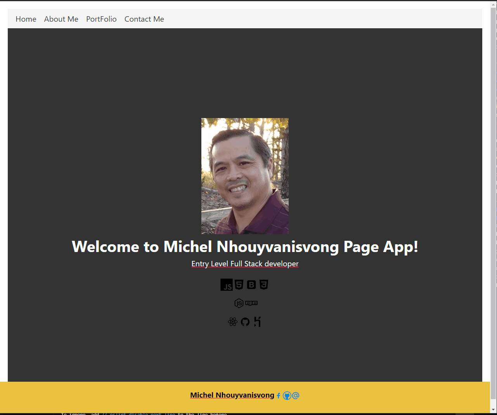

# reactportfolio
portfolio using React Mainframe

# Table of Content
- [Assignment](#assignment)
- [Requirements](#requirements)
- [Video](#video)

# Assignment
Now that you've worked with React and have multiple projects to share, you'll be updating your portfolio and other materials to build toward being employer competitive. Creating a portfolio using React will help set you apart from other developers whose portfolios do not use some of the latest technologies.  

If you are opting out of career services, this is still a required assignment. Part of being a web developer means being a part of a community. Having a place to share your projects is necessary if you're applying for jobs, but is still critical on your journey as a developer.

# Requirements
- Updated portfolio featuring 6 total projects

- Use React

- A Header component that appears on multiple pages

- A single Project component that will be used multiple times on a single page

- Navigation with React Router, dynamic rendering, or another third part router

- A Footer component that appears on multiple pages

- Update GitHub profile with pinned repositories featuring those same projects

- Deploy this site to GitHub Pages using the Create React App docs for deployment.

- Important: Be sure to push your codebase to GitHub and NOT your built and deployed code. Ensure this happens by following the above instructions and using the gh-pages branch to host the deployed application's code.

# Video
